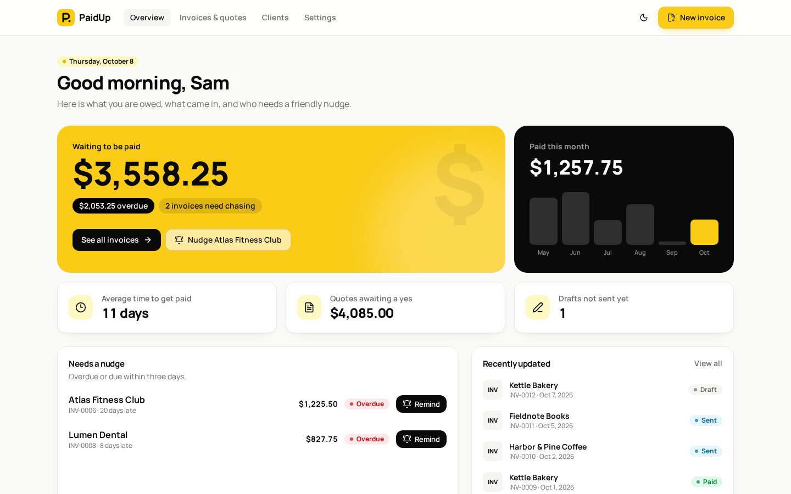
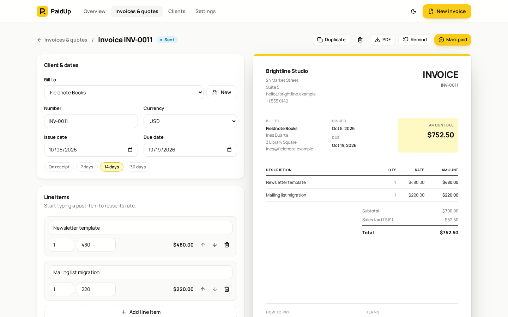
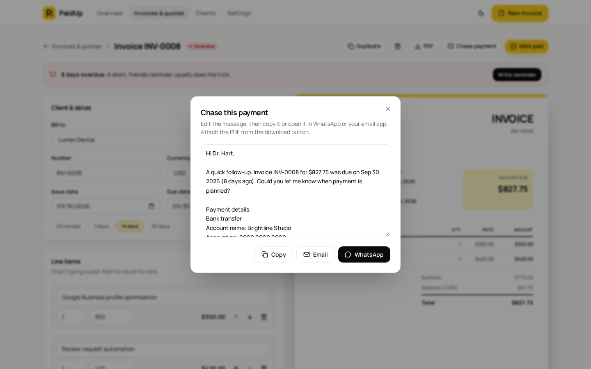
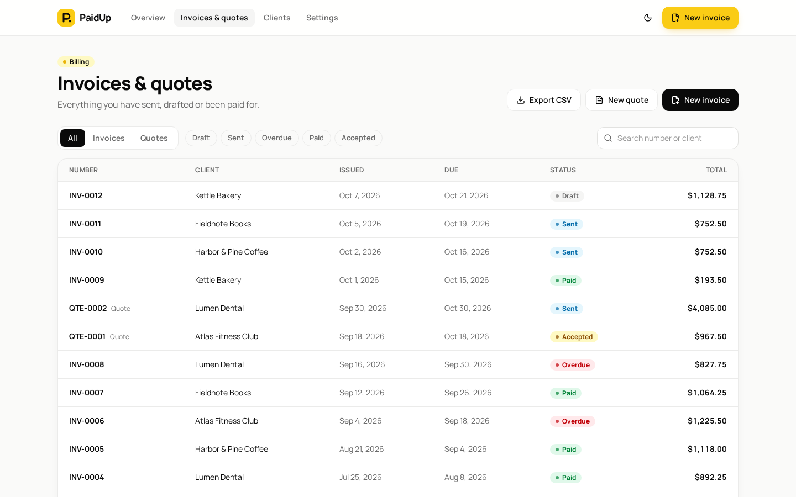
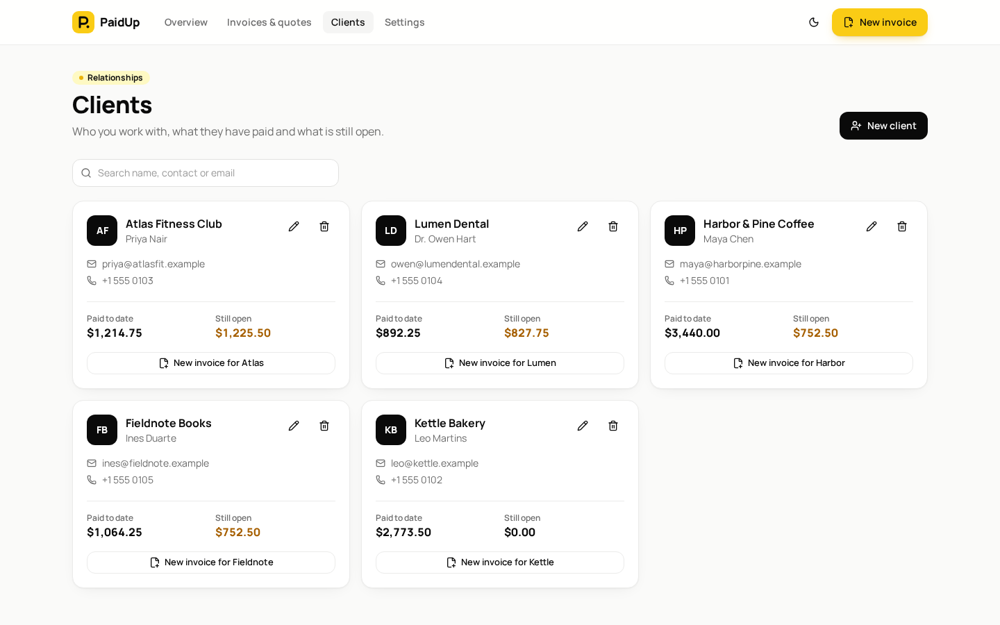
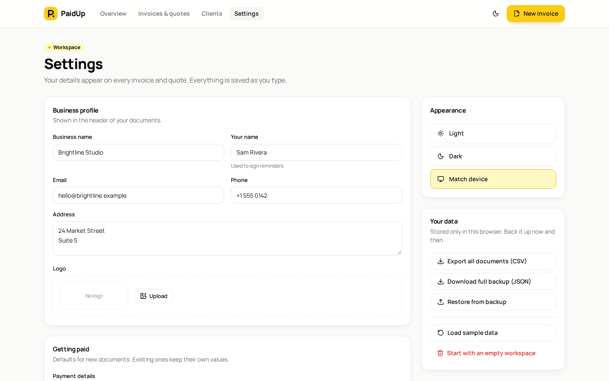
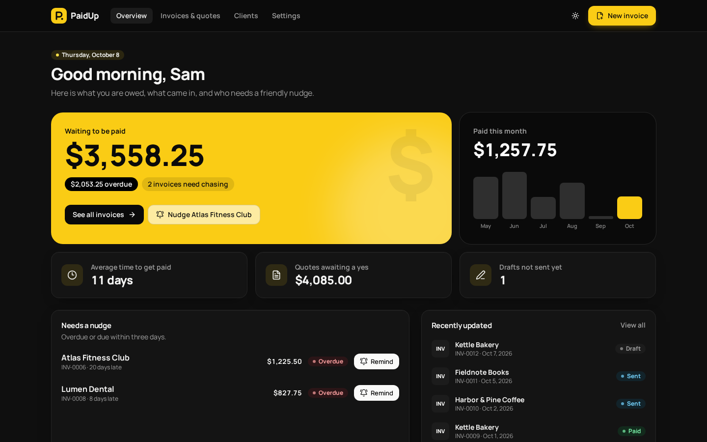
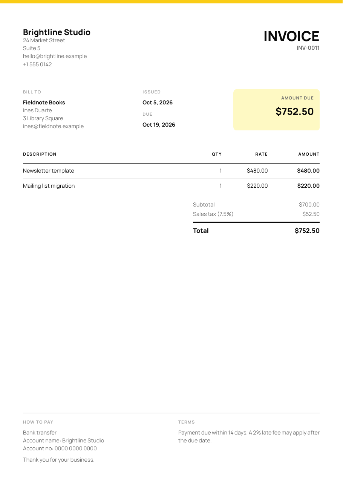
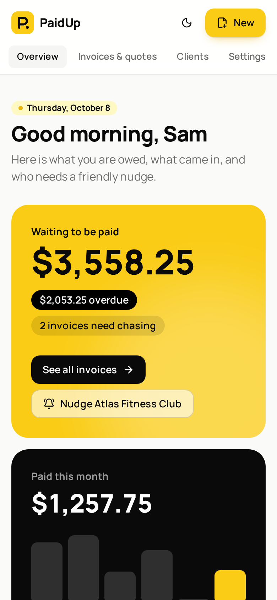

# PaidUp

**Invoices and quotes for freelancers and small studios, with reminders that actually get you paid.**

Sending an invoice is easy. Getting paid on time is the hard part: you forget who is late, you feel awkward chasing, and money sits in other people's accounts. PaidUp keeps every invoice and quote in one place, shows what you are owed at a glance, and writes the polite follow-up for you, ready to send on WhatsApp or email.

It opens with a fictional sample studio so you can try everything straight away. No sign-up, no server, no API keys. See [Run locally](#run-locally).



## Features

**Overview**
- What you are owed, how much of it is overdue, and how many invoices need chasing
- Paid this month, with the last six months as bars
- Average days to get paid, value of quotes waiting for a yes, and unsent drafts
- "Needs a nudge" list of invoices that are overdue or due within three days, each with a one-click reminder

**Invoices & quotes**
- One list for both, with type tabs, status filters (draft, sent, overdue, paid, accepted), search and CSV export
- Overdue is worked out from the due date, so nothing has to be updated by hand

**Editor**
- Live paper preview next to the form, matching the PDF exactly
- Client picker with an inline "New client" form, payment-term shortcuts (on receipt, 7, 14, 30 days) and per-document currency
- Line items with reorder and remove; typing a past item reuses its last rate
- Percentage or fixed discount applied before tax, capped so a total can never go negative
- Duplicate-number warning, duplicate as a new draft, delete with confirmation
- Status actions that fit the moment: send, remind, mark paid or unpaid, decline a quote, or convert an accepted quote into a linked draft invoice

**PDF export**
- A4 PDF rendered in the browser with bundled fonts, so it looks the same everywhere and works offline
- Your logo, payment details, notes and terms included

**Reminders**
- Messages that change tone with the situation: first send, friendly reminder before the due date, firmer follow-up once overdue (with days late), thank-you once paid, approval request for quotes
- Edit the text, then copy it or open it in WhatsApp or your email app with everything filled in

**Clients**
- Client cards with paid-to-date and still-open totals, contact links and "New invoice for…" shortcut

**Settings**
- Business profile and logo (with width control), payment details, tax name and rate, currency, numbering prefixes, payment terms and default notes
- Full JSON backup and validated restore, CSV export, sample data or an empty workspace
- Light, dark or match-device theme

## Screenshots

| Editor with live preview | Reminder |
| --- | --- |
|  |  |
| **Invoices & quotes** | **Clients** |
|  |  |
| **Settings** | **Dark mode** |
|  |  |

| Exported PDF | Phone |
| --- | --- |
|  |  |

## Design

- **Palette:** a confident yellow (#FACC15) with black ink on white; true black in dark mode with the same yellow accents
- **Type:** Manrope throughout, self-hosted, also embedded in the PDFs
- **Details:** a bold yellow "owed" card next to a black "paid" card, pill status badges, soft card shadows and a paper preview with a yellow top edge

## Tech stack

- React 19 and TypeScript, built with Vite
- Tailwind CSS v4
- Zustand with `persist` for local-first storage
- @react-pdf/renderer for PDFs (loaded only when you export)
- wouter for routing, Radix Dialog, zod for validation, sonner for toasts
- Vitest and Testing Library
- GitHub Actions for lint, tests and build

## Project structure

```
src/
  lib/          money, dates, invoice maths, reminders, CSV and backup (pure and unit tested)
  store/        persisted store and fictional sample data
  pages/        Overview, Invoices & quotes, Editor, Clients, Settings
  components/   paper preview, send dialog, client form, UI primitives
  pdf/          PDF layout and on-demand export
```

## Run locally

Requirements: Node.js 20 or newer and pnpm (`corepack enable` or `npm install -g pnpm`).

```bash
git clone https://github.com/gabrielolarinre74-pixel/paidup.git
cd paidup
pnpm install
pnpm dev
```

Open http://localhost:5173.

### Demo mode

PaidUp starts with a fictional studio, five fictional clients and a mix of paid, sent, overdue and draft documents, with dates generated relative to today. Everything you change is saved in your browser's `localStorage` and never leaves your device. Use **Settings → Load sample data** to reset, or **Start with an empty workspace** to use it for real.

### Other commands

```bash
pnpm test
pnpm lint
pnpm build     # static site in dist/
pnpm preview
```

No API keys are needed. `.env.example` lists the one optional build setting.

## Roadmap

- Shareable payment page per invoice with a pay-now link
- Scheduled reminders that send themselves
- Recurring invoices for retainers

## License

MIT. See [LICENSE](LICENSE).

---

Designed and developed by **Gabriel Zion** · [Gabriel.ATH](https://gabrielzion-portfolio.vercel.app). Websites, apps, automation and UI/UX for growing businesses.
